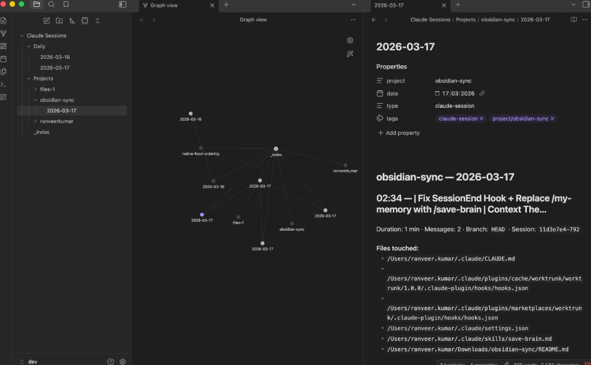

# Obsidian Session Sync for Claude Code

Every Claude Code session becomes an Obsidian note — automatically.

## Why

You spend hours in Claude Code sessions: debugging, building features, exploring architectures. When the session closes, all that context evaporates. Next week you'll re-discover the same gotcha, re-make the same decision, re-debug the same edge case.

This tool fixes that. Every session creates a searchable, linked Obsidian note. No effort on normal exits. When a session matters, type `/save-brain` and Claude writes a proper summary before closing.

Your vault becomes a growing knowledge base of everything you've built, organized by project and date.

## Demo



## Install

```bash
cd obsidian-sync
bash install.sh
```

### Set your Obsidian vault path

Notes are written to `Claude Sessions/` **inside** the vault folder. The path must be the **exact folder you open in the Obsidian app** (e.g. `~/vault/dev`), otherwise notes will not appear in your vault.

**Default:** `~/vault` → notes go to `~/vault/Claude Sessions/`

**Option A — Edit the script default (persistent):**  
Open `~/.claude/hooks/obsidian-session-sync.py`, find the `VAULT_PATH` block and change the default:

```python
VAULT_PATH = Path(os.environ.get(
    "OBSIDIAN_VAULT_PATH",
    os.path.expanduser("~/vault/dev")   # ← set to your vault folder
))
```

**Option B — Use an environment variable (no script edit):**  
Set `OBSIDIAN_VAULT_PATH` so the hook and CLI use your vault. Example for vault at `~/vault/dev`:

- **One-off sync to a different vault:**  
  `OBSIDIAN_VAULT_PATH=~/vault/other python3 ~/.claude/hooks/obsidian-session-sync.py --sync --dry-run`
- **Always use a specific vault:** set the variable in the hook wrapper (e.g. in `obsidian-hook.sh` before calling the Python script) or in your shell profile so it’s set when Claude Code runs.

After changing the path, run the verify commands below and confirm the folder exists.

### Verify

```bash
cat ~/.claude/settings.json | python3 -m json.tool   # hooks registered?
ls ~/.claude/hooks/                                    # scripts in place?
ls ~/vault/dev/Claude\ Sessions/                       # vault structure? (use your vault path)
```

## Two Exit Paths

### `/exit` or Ctrl+D — free, every session

Hook fires → parses transcript JSONL → extracts project, files, tools, prompts, TODOs → writes note. **Zero tokens, pure offline parsing.**

### `/save-brain` — AI summary, ~$0.01 per use

Type `/save-brain` as a message (not a built-in command — just type it and hit enter). Hook intercepts it → Claude generates a structured summary → Stop hook captures it → writes rich note marked with 🧠.

**Use `/save-brain` when:**

- Deep debugging session with decisions worth remembering

- Feature implementation with architecture choices

- Session you'll need to resume later

**Use `/exit` when:**

- Quick fix, trivial session

- Exploring / prototyping

## What Gets Generated

### Free path (heuristic)

```markdown

## 14:32 — Replace useUpcomingTrip with useActivityCard

Duration: 3h 43m · Messages: 12 · Branch: `feat/rbac` · Session: `eb5b0174...`

**Files touched:**

- `src/pages/Home/SearchFormWithTrip/SearchFormWithTrip.tsx`

- `src/pages/Home/helper/helper.ts`

**Tools:** Edit (7), Read (15), Bash (10)

**What I worked on:**

> Replace useUpcomingTrip with useActivityCard (API-driven Recent Searches)

> ...last: it should pick the first of recommended not recent searches

**TODOs:**

- [ ] Add unit tests for the auto-fill logic

```

### `/save-brain` path (AI summary)

```markdown

## 14:32 — Replace useUpcomingTrip with useActivityCard 🧠

Duration: 3h 43m · Messages: 12 · Source: AI summary

## Session Summary

Migrated the food ordering home page from useUpcomingTrip to useActivityCard...

## Key Decisions

- Chose activityCard API over upcomingTrips (no auth required)

- recommendedTrips takes priority over recentSearches for auto-fill

## Files Changed

- `SearchFormWithTrip.tsx` — Switched from useUpcomingTrip to useActivityCard

- `helper.ts` — Fixed priority: recommended first, then recent

## Gotchas / Learnings

- The old endpoint required auth, new one works for logged-out users

```

## Smart Parsing

The script handles real-world session noise:

- **Plan prompts:** `"Implement the following plan: # Plan: Fix auto-fill..."` → title becomes "Fix auto-fill..."

- **Local command caveats:** `<local-command-caveat>` tags are stripped entirely

- **Long prompts:** Truncated to readable length, multiline collapsed

- **Empty sessions:** Skipped (< 2 user messages)

## Vault Structure

```

~/vault/dev/Claude Sessions/

├── Projects/

│   ├── projectname/

│   │   └── 2026-03-17.md     ← all sessions today (appends with timestamps)

│   └── dev-routing/

│       └── 2026-03-15.md

├── Daily/

│   └── 2026-03-17.md          ← links to every project worked on today

└── _index.md                   ← master Map of Content

```

**Project detection:** last folder name from `cwd`. `/Users/ranveer.kumar/folder/projectname` → `projectname`

**Linking:** wikilinks throughout, tags `#claude-session`, `#project/<name>`. Graph view works.

## Commands

### Bulk sync existing sessions

All commands write to the vault path from **Set your Obsidian vault path** (script default or `OBSIDIAN_VAULT_PATH`). To sync to a **different vault** for one run, set the env var:

```bash
# Use a different vault for this run only
OBSIDIAN_VAULT_PATH=~/path/to/other-vault python3 ~/.claude/hooks/obsidian-session-sync.py --sync --dry-run
```

```bash
# Preview (no writes)
python3 ~/.claude/hooks/obsidian-session-sync.py --sync --dry-run

# Sync all
python3 ~/.claude/hooks/obsidian-session-sync.py --sync

# Last 10 only
python3 ~/.claude/hooks/obsidian-session-sync.py --sync --recent 10

# Force re-sync (ignore tracking)
python3 ~/.claude/hooks/obsidian-session-sync.py --sync --force
```

Uses actual transcript timestamps, so old sessions get the correct date.

### Convert JSONL to readable format

The raw `.jsonl` transcripts are unreadable. Convert to clean markdown:

```bash

# Markdown (default — much more readable)
python3 ~/.claude/hooks/obsidian-session-sync.py --convert <file.jsonl>

# JSON (structured, for scripts)
python3 ~/.claude/hooks/obsidian-session-sync.py --convert <file.jsonl> --json

```

The markdown output looks like:

```markdown

# Session: food

ID: `2c10d3be` · Branch: `feat/recent-searches` · Duration: 3h 43m · Messages: 12

---

### [12:13:00] You (#1)

Replace useUpcomingTrip with useActivityCard (API-driven Recent Searches)

### [12:15:00] Claude

  `Read` → file: src/pages/Home/api/upcomingTrips/upcomingTrips.ts

  `Edit` → file: src/pages/Home/SearchFormWithTrip/SearchFormWithTrip.tsx

I'll implement the plan to replace useUpcomingTrip with useActivityCard...

### [15:50:00] You (#3)

it should pick the first of recommended not recent searches

---

## Files touched

- `src/pages/Home/SearchFormWithTrip/SearchFormWithTrip.tsx`

- `src/pages/Home/helper/helper.ts`

```

### List projects

```bash
python3 ~/.claude/hooks/obsidian-session-sync.py --list-projects
```

## How the Hooks Work

| Hook | Fires on | What it does | Performance |

|---|---|---|---|

| `UserPromptSubmit` | Every message | Bash checks if it's `/save-brain` via `jq` (~3ms). Only launches Python on match. | ~3ms for non-matches |

| `Stop` | Claude finishes responding | Captures AI summary if `/save-brain` flag exists. Writes to Obsidian. | ~100ms |

| `SessionEnd` | Session closes | Backup trigger, same as Stop with dedup lock. | ~100ms |

The `UserPromptSubmit` hook uses a fast bash gate `my-memory-check.sh`) that does a `jq` string check on every message. Python only starts when you actually type `/save-brain`. Regular messages cost ~3ms.

## Files

```

~/.claude/hooks/

├── obsidian-session-sync.py    ← main script (parser, writer, CLI); vault path in VAULT_PATH / OBSIDIAN_VAULT_PATH
├── obsidian-hook.sh            ← Stop/SessionEnd wrapper (dedup lock)
├── my-memory-check.sh          ← fast bash gate for UserPromptSubmit
└── my-memory-prompt-hook.py    ← /save-brain prompt replacement (only runs on match)

```

## Logs & Debugging

```bash

tail -f ~/.claude/obsidian-sync.log                           # hook log

cat ~/vault/dev/Claude\ Sessions/.synced_sessions             # synced tracker

cat ~/.claude/settings.json | python3 -m json.tool            # verify hooks

```

## Troubleshooting

**Notes not appearing in Obsidian:** The script’s vault path must be the **folder you open in Obsidian**. Check with `ls <your-vault-path>/Claude\ Sessions/` and see **Set your Obsidian vault path** above. Check logs.

**Hook not firing:** Run `/hooks` inside Claude Code. Needs version 1.0.85+.

**/save-brain not working:** Type `/save-brain` and press enter. It's a skill — it should appear in autocomplete. If not, check that `~/.claude/skills/save-brain.md` exists.

**Duplicate notes:** `.synced_sessions` tracks processed sessions. Dedup lock prevents Stop + SessionEnd double-writes. Use `--force` to re-process.
